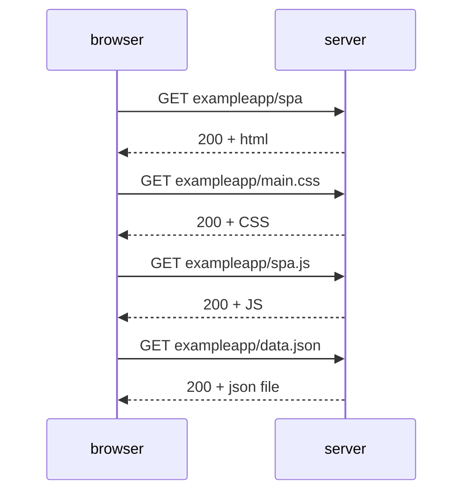

# 0.5: Single page app diagram

User goes to https://studies.cs.helsinki.fi/exampleapp/spa

```mermaid
sequenceDiagram
    participant browser
    participant server

    browser->>server: GET exampleapp/spa
    server-->>browser: 200 + html
    browser->>server: GET exampleapp/main.css
    server-->>browser: 200 + CSS
    browser->>server: GET exampleapp/spa.js
    server-->>browser: 200 + JS
    browser->>server: GET exampleapp/data.json
    server-->>browser: 200 + json file
```
